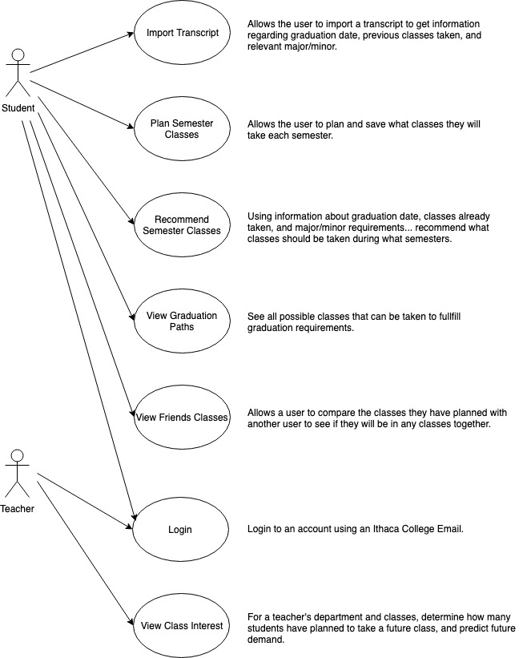
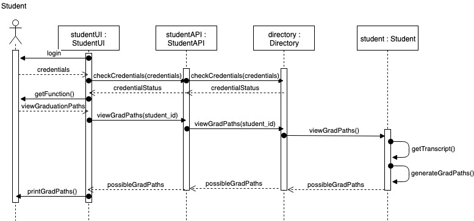
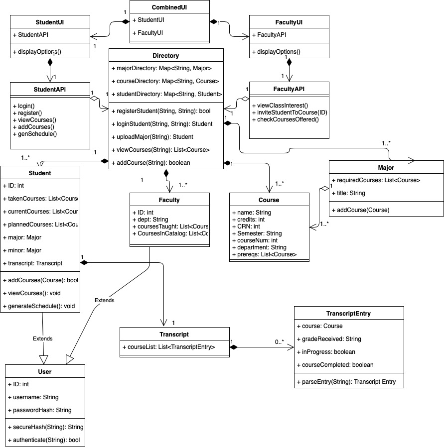
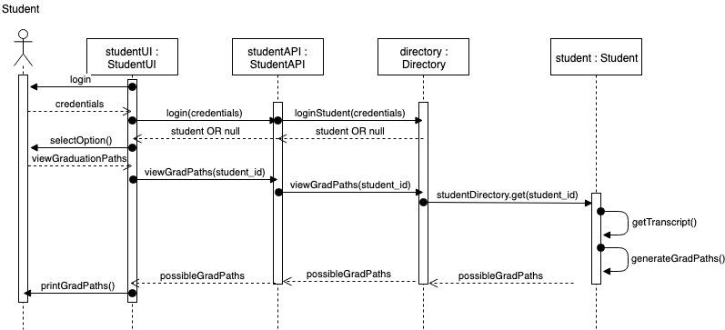

# Class Planner 
## Created by Joe Cleveland, Dan McCaffrey, Alex Python, and Dylan Shane

#### Description:
Class Planner is intended to expand on functionality offered by Degree Works. 
It is a way for students to view more robust information regarding their future classes at Ithaca College, and create a better plan. 
The software allows students to log in using their Ithaca College Email and import their transcript/degree requirements. 
The software then uses this information to determine what classes are needed for a student to graduate, allow them to filter and choose which of these possible remaining classes they prefer to take, and present possible semester class schedules that a student can take given the classes they have chosen. 
The software also allows students to compare their schedules with a friend’s, given permission, allowing them to easily see if they will be or can be in any classes together. 
Finally the software allows teachers to login using their Ithaca College Email and allows them to see the expected future interest in classes they teach.

#### Use Case Diagram:

#### Constructive Collaboration:
In order to productively work on ClassPlanner at the same time, we will be breaking up into two smaller groups. For at least the first sprint, the entire group will be working on the student side of ClassPlanner and will lead to the following break up of work:
* 2 people will work on Transcript, Major, and Minor - These will provide the course functionality of the system
* 2 people will work on the Student, StudentAPI, StudentUI (& CombinedUI to get into StudentUI) - This will provide the student functionality for the system.
For the second sprint we are splitting up the sprint goal into web scraping, beginnning to request schedules, and dealing with majors.
This is an effective break down of the system because the pairs will each have multiple classes to work on separately. This should limit the direct dependencies between members of the entire group.

#### Sprint 1:
Sprint Goal: Allow students to upload their transcript and view their graduation requirements (on the way to getting semester schedules).

Sprint 1 Review Agenda: https://docs.google.com/document/d/1bdwsNKYNy78iPnmrDw8bjLgYCWM1s2EtdD01Kj5EsLY/edit?usp=sharing
Sprint 1 Retrospective: https://docs.google.com/document/d/1oXoySuA57THElxI3NhtHu9jUS7e0WjkKYyz740Xx4TM/edit?usp=sharing

#### Use Cases/Narratives to Develop Sprint 1:
1. View Current Schedule
2. Student Upload Transcript

#### Link for Client Narratives Sprint 1: 
https://docs.google.com/document/d/1SFKT3TnqM1oDATUORLqnYdA5S14drWhr_GxGILWN4oM/edit?usp=sharing

#### Link to Class Diagram Sprint 1:
https://drive.google.com/file/d/13ZaL421P3cTURQgeACvPvqre03yMlLVa/view?usp=sharing

#### Sequence Diagram Sprint 1:

This sequence diagram is for the Student's view graduation paths use case.
The student logs in, tries to view graduation paths, and is then printed a report of all the classes they can take to graduate.

#### Sprint 2:
Sprint Goal: Student's should be able to choose their major, see their major requirements, request a schedule for next semester, and have the directory populated with Ithaca College's majors and courses.

#### Use Cases/Narratives to Develop Sprint 2:
1. View Graduation Paths
2. Recommend Semester Classes
3. Plan Semester Classes

#### Link to Class Diagram Sprint 2:

#### Sequence Diagram Sprint 2:

This sequence diagram is for the Student's view graduation paths use case.
The student logs in, tries to view graduation paths, and is then printed a report of all the classes they can take to graduate.
This is very similar to the diagram for Sprint 1, but the methods have been updated. 
There are no new updates to the classes used in this use case.

