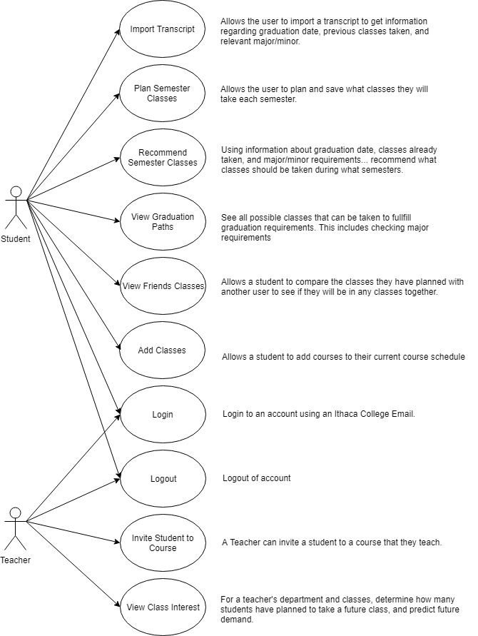

# Class Planner
## Created by Joe Cleveland, Dan McCaffrey, Alex Python, and Dylan Shane

#### Description:
Class Planner is intended to expand on functionality offered by Degree Works. 
It is a way for students to view more robust information regarding their future classes at Ithaca College, and create a better plan. 
The software allows students to log in using their Ithaca College Email and import their transcript/degree requirements. 
The software then uses this information to determine what classes are needed for a student to graduate, allow them to filter and choose which of these possible remaining classes they prefer to take, and present possible semester class schedules that a student can take given the classes they have chosen. 
The software also allows students to compare their schedules with a friend’s, given permission, allowing them to easily see if they will be or can be in any classes together. 
Finally the software allows teachers to login using their Ithaca College Email and allows them to see the expected future interest in classes they teach.

#### Use Case Diagram:

#### Link for Client Narratives: 
https://docs.google.com/document/d/1SFKT3TnqM1oDATUORLqnYdA5S14drWhr_GxGILWN4oM/edit?usp=sharing

#### Use Cases/Narratives to Develop First
1. 
1. 
1. 

#### Class Diagram:

#### Class Diagram:
